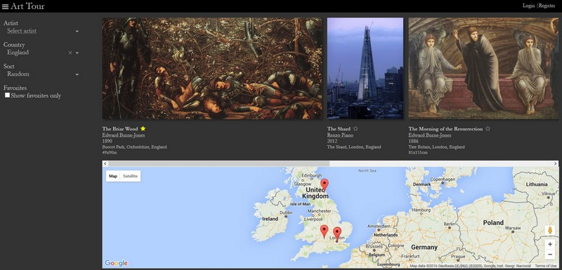

# Art Tour

Art Tour helps you plan travel around artworks you'd like to see. It's at an early stage of development, so lacks login features, and only has 50 or so artworks 

Project structure
---------------------------

* client - front-end react app
* server - back-end server code

### client

This is the client webapp - it's compiled with `brunch w` to the `public` subfolder.

The `components` subfolder contains the React jsx code, which gets translated to
plain JavaScript.

Files in the `assets` subfolder are copied as-is to the public folder.

All other code is compiled together into `public\js\app.js`.

### server

This is the Express server. It's started with the nodemon script on Windows, or
`npm run start` on the Amazon EC2 server.

#### models

The data in this folder is used by the server.

To import images, update filenames in the tosee folder - only images prefixed
with ! will be imported.

Follow this structure - `[!][@*][tags]*[artistkey][year][title][dimensions] - [location]`, 
eg `!@@@pose dragon colors armor tosee art ebjones 1884 Perseus The Doom Fulfilled 155x141cm - Germany, Stuttgart, Staatsgallerie.jpg`

Note dimensions should be given in `[height]x[width][in|cm]`. 

* Add any new tags to the list of tags in import.js. 
* Add the artist to artists.js (or add the key to aliases of an existing artist).
* Add the location to locations.js (use one of the words in the location string as the key).
* Clear the contents of the app/assets/images folder.

Then run

    > node import.js
    
this will update the artworks.js file.

Local development
---------------------------------

### Start the server

    > cd server
    > nodemon server/server.js
or run the bat file.

### Start the build watcher

    > cd client
    > brunch w
    
or run the bat file.

This will watch the client folder for changes and compile them to the client/public folder.

### View the website

    > start http://localhost:4000/

or run the bat file.
(can't just open public/index.html)

### Import images

    > cd server
    > npm run import
    
See server/models/README.md

### Backup code

Run the bat file - copies source files to folder on Dropbox (not developing on Dropbox due to huge amt of node module files).

### Deploy code to the server

Run the bat file.

Server (Amazon EC2)
-------------------------------

### Connect to server via ssh

    > ssh amz
    
This uses the amz settings in c:\users\bburns\home\.ssh\config

### Go go the directory

    > cd sites/arttour

### Check the arttour express process

    > pm2 list
    
Pm2 is a persistent node runner

### Reload the express server process

    > pm2 reload <id>
    
or

    > pm2 restart <id>
    
do this after deploying code from the local computer

### Stop it

    > pm2 delete <id>

### Start it

    > cd server
    > npm start

License
-------------------------------

GPL

